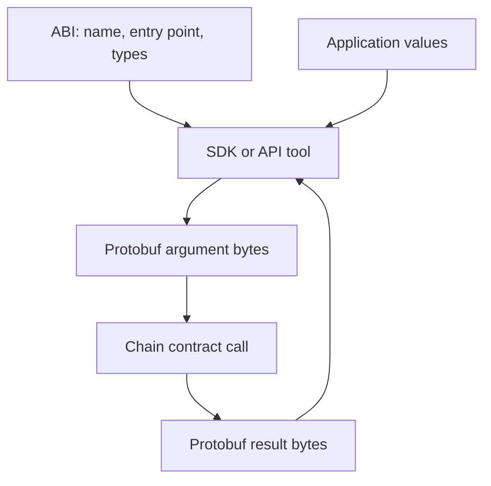

# Contract ABI

A Koinos contract Application Binary Interface (ABI) is a JSON description of
the contract's callable interface. It tells tools how to map a method name to an
entry point and how to encode the method's protobuf arguments and result.

An ABI is not the contract bytecode, and it does not prove that the deployed
contract implements the described behavior.

## Method descriptions

An ABI method record identifies:

| Field | Purpose |
| --- | --- |
| Method name | Human-readable name used by SDKs and API tools |
| Argument type | Fully qualified protobuf message for the input |
| Result type | Fully qualified protobuf message for the output |
| Entry point | 32-bit value dispatched by the contract |
| Read-only flag | Indicates whether tooling should use a read-only call or build a transaction |
| Description | Optional human-readable explanation |

The entry point, argument type, and result type must match the deployed
contract. A read-only flag helps tooling choose the request path, but Chain
still enforces whether execution attempts to change state.

## Type descriptors

The ABI's `types` value contains a Base64-encoded protobuf descriptor set. It
allows a tool to discover the message fields needed to encode arguments and
decode results without compiling the original `.proto` files into that tool.

This descriptor is a schema, not a sample payload. The actual argument and
result values are serialized separately for each call.

## How the ABI is used

SDKs use the ABI to offer named contract methods instead of requiring users to
calculate entry points and serialize raw bytes manually. Contract Meta Store
indexes metadata published on-chain so API clients can look up an ABI by
contract ID.

Because a derived metadata index can lag Chain, applications that require a
specific interface should verify that the ABI matches the contract version they
intend to call.

For generating and using an ABI during development, continue with
[Smart Contract Development](../contracts/index.md).

## Versioned sources

- [KOIN contract ABI at the inspected system-contract revision](https://github.com/koinos/koinos-contracts-as/blob/aef57bdb8a5960ec2b799ee0f17bf7a25bb5de85/contracts/koin/abi/koin.abi)
- [`koinos-contract-meta-store` v1.1.0](https://github.com/koinos/koinos-contract-meta-store/tree/64e803e1db1a9bb2946ae379ddad0e5611442ec5)
- [Contract metadata schema in `koinos-proto` v2.6.0](https://github.com/koinos/koinos-proto/blob/f3ba7c54d72ddd7b6898a0e2ab7567dcf60ccd80/koinos/contract_meta_store/contract_meta_store.proto)
