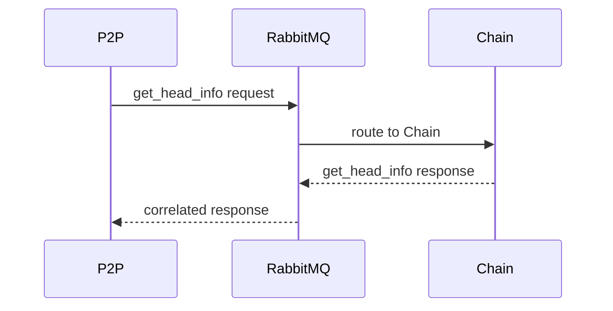
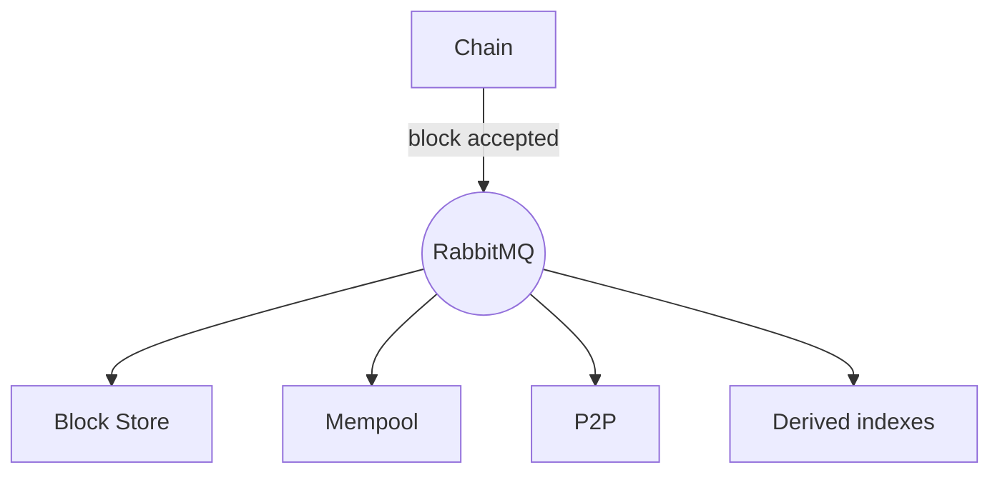

# Internal messaging

Koinos microservices exchange Protocol Buffer messages through RabbitMQ using
AMQP 0.9.1. This internal bus supports two different communication patterns:
RPC and broadcasts.

RabbitMQ connects services inside one Koinos node. P2P is the separate protocol
boundary used to communicate with other nodes.

## RPC

An RPC has a request, one destination service, and a response. A service sends a
protobuf request to the `koinos.rpc` exchange, and RabbitMQ routes it to the
queue for the target service. A correlation identifier associates the response
with the original request.

API gateways use this same path after translating an external JSON-RPC or gRPC
request. A gateway timeout does not by itself reveal whether the destination
finished processing a state-changing request.

## Broadcasts

A broadcast announces an event to every interested subscriber. Broadcasts use
the `koinos.event` exchange and topic-based routing keys.

For example, after Chain accepts a block, Block Store can persist it, Mempool
can update pending transactions, P2P can propagate it, and index services can
update their derived views.

The versioned broadcast schema includes accepted and irreversible blocks,
accepted and failed transactions, Mempool acceptance, fork heads, gossip
status, and contract event parcels.

## Delivery and consistency

Messaging separates services, but it does not make their databases atomic:

- Chain can advance before a downstream index processes the broadcast.
- A consumer must handle redelivery without corrupting its state.
- Recent accepted-block data can change after a fork.
- RPC availability depends on RabbitMQ and the destination service.
- Replicating a stateful writer or broadcast consumer requires explicit
  ownership and consistency support; it must not be inferred from the
  microservice design.

RabbitMQ queue durability, credentials, exposure, and recovery are deployment
concerns documented under [Node Operators](../nodes/index.md).

## Versioned sources

- [RabbitMQ in the official Compose topology](https://github.com/koinos/koinos/blob/821674672e699bf56e94d7c0e8bce122e83d1482/docker-compose.yml)
- [RPC envelope in `koinos-proto` v2.6.0](https://github.com/koinos/koinos-proto/blob/f3ba7c54d72ddd7b6898a0e2ab7567dcf60ccd80/koinos/rpc/rpc.proto)
- [Broadcast definitions in `koinos-proto` v2.6.0](https://github.com/koinos/koinos-proto/blob/f3ba7c54d72ddd7b6898a0e2ab7567dcf60ccd80/koinos/broadcast/broadcast.proto)
- [AMQP 0.9.1 specification](https://www.rabbitmq.com/amqp-0-9-1-reference)
