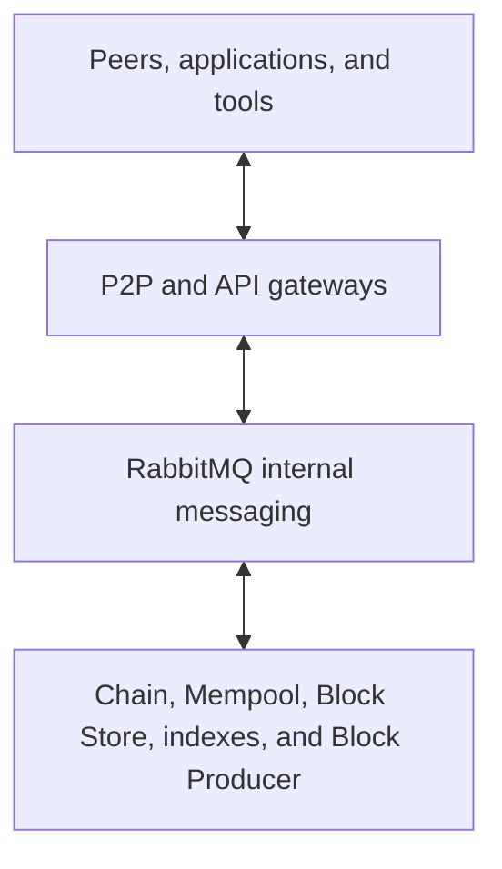

# Microservices

A Koinos node is composed of services with separate responsibilities. RabbitMQ
provides the internal message bus. Chain validates consensus state, P2P connects
the node to peers, and the remaining services store artifacts, maintain working
state, build query indexes, produce blocks, or expose APIs.

Separating these responsibilities makes the node modular, but it also means
that process health and data consistency are different questions. An API can be
reachable while its target service is unavailable or catching up.

The arrows show communication relationships. They do not imply that every
service can write every database or that all services can be replicated without
coordination.

## Services in the official deployment bundle

The selected
[Compose topology](https://github.com/koinos/koinos/blob/821674672e699bf56e94d7c0e8bce122e83d1482/docker-compose.yml)
contains a core node and optional production, API, and index services.

| Service | Role |
| --- | --- |
| [RabbitMQ](interprocess-communication.md) | Routes internal RPC requests and broadcasts |
| [Chain](microservices/koinos-chain.md) | Validates blocks and transactions, executes contracts, and owns canonical state |
| [Mempool](microservices/mempool.md) | Maintains the fork-aware pending-transaction view |
| [Block Store](microservices/block-store.md) | Stores blocks and receipts for retrieval |
| [P2P](microservices/p2p.md) | Connects to peers, gossips data, and coordinates synchronization |
| [Block Producer](microservices/block-producer.md) | Optionally assembles, signs, and submits blocks |
| [JSON-RPC](microservices/json-rpc.md) | Exposes an HTTP JSON-RPC gateway |
| [gRPC](microservices/grpc.md) | Exposes a typed protobuf gateway |
| [REST](microservices/rest.md) | Exposes REST/OpenAPI endpoints through JSON-RPC |
| [Transaction Store](microservices/transaction-store.md) | Builds a transaction lookup index |
| [Contract Meta Store](microservices/contract-meta-store.md) | Builds a contract metadata and ABI index |
| [Account History](microservices/account-history.md) | Builds a fork-aware account activity index |

The core Compose services are RabbitMQ, Chain, Mempool, Block Store, and P2P.
The other services are enabled through Compose profiles in this release. That
deployment grouping can change, so operator configuration should always follow
the selected release rather than this architecture summary.

## State ownership

| State | Service | Consistency meaning |
| --- | --- | --- |
| Consensus state | Chain | Authoritative for local validation and execution |
| Blocks and receipts | Block Store | Durable artifacts; Chain still decides validity |
| Pending transactions | Mempool | Transient, fork-aware working state |
| Transaction lookup | Transaction Store | Derived index that can lag Chain |
| Contract metadata | Contract Meta Store | Derived index that can lag or follow a fork |
| Account activity | Account History | Derived, fork-aware index |
| API request state | JSON-RPC, gRPC, REST | Gateway state only; not blockchain state |

An accepted block can still be replaced before it becomes irreversible.
Services that index accepted blocks must therefore follow fork changes and
irreversible-block information. A derived index can be incomplete while Chain
is already synchronized.

## Internal and external boundaries

- [Internal messaging](interprocess-communication.md) carries service RPC and
  broadcasts through RabbitMQ.
- [P2P](microservices/p2p.md) exchanges blocks and transactions with other
  Koinos nodes.
- API gateways translate external protocols into internal service requests.
- Smart contracts execute inside the Chain service's WebAssembly runtime.

For selecting services and operating their data, continue with
[Node Operators](../nodes/microservices.md).

## Versioned sources

- [Official service versions](https://github.com/koinos/koinos/blob/821674672e699bf56e94d7c0e8bce122e83d1482/env.example)
- [Official Compose topology](https://github.com/koinos/koinos/blob/821674672e699bf56e94d7c0e8bce122e83d1482/docker-compose.yml)
- [RPC service definitions in `koinos-proto` v2.6.0](https://github.com/koinos/koinos-proto/blob/f3ba7c54d72ddd7b6898a0e2ab7567dcf60ccd80/koinos/rpc/services.proto)
- [Broadcast definitions in `koinos-proto` v2.6.0](https://github.com/koinos/koinos-proto/blob/f3ba7c54d72ddd7b6898a0e2ab7567dcf60ccd80/koinos/broadcast/broadcast.proto)
