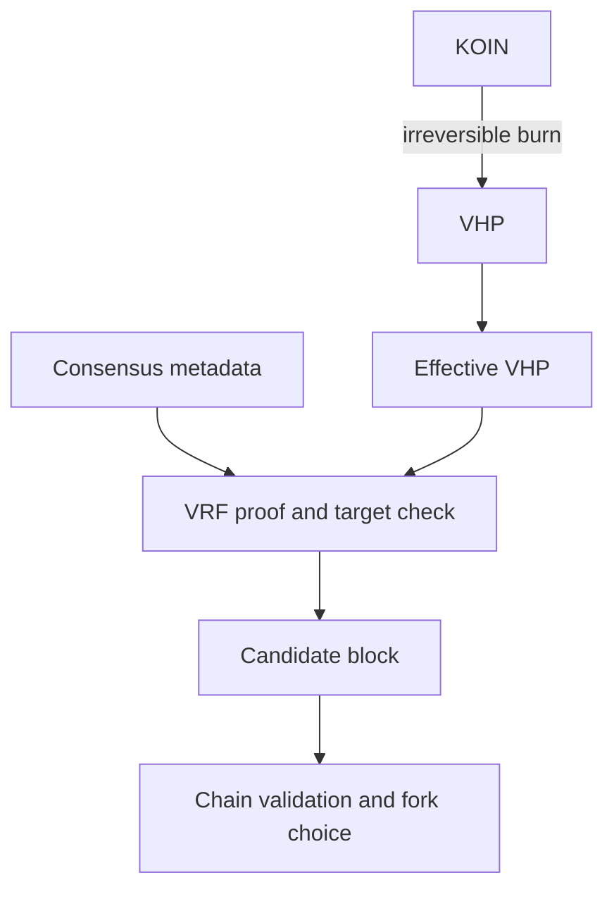

# Proof of Burn

Koinos uses Proof of Burn (PoB) to select and validate block production.
Participants permanently burn KOIN through the PoB system contract and receive
Virtual Hash Power (VHP). VHP represents production power; it is not ordinary
spendable KOIN.

Burning KOIN is an irreversible transaction. This architecture page explains
the relationship without providing executable burn or producer-registration
instructions.

## From KOIN to effective VHP

The PoB contract burns KOIN and mints the corresponding amount of VHP. The VHP
contract tracks both the token balance and the amount considered **effective**
for consensus.

Transfers of VHP are subject to an effectiveness delay. This prevents the same
production power from being moved rapidly between accounts and counted more
than intended.

## Block eligibility

For each production opportunity, Block Producer obtains current consensus
metadata from Chain and creates a verifiable random function (VRF) proof. The
protocol evaluates that proof using the producer's effective VHP and the current
difficulty.

More effective VHP increases the probability of satisfying the target, but it
does not reserve a deterministic sequence of blocks. A candidate that satisfies
the production condition is still submitted to Chain and must pass normal block
validation.

## VHP consumption and replenishment

Successful production consumes a protocol-calculated amount of VHP. A producer
therefore cannot assume that one initial KOIN burn provides permanent production
capacity. Producers may need to replenish VHP over time to maintain their
intended production power.

Consensus parameters and current balances are on-chain state and can change.
Architecture documentation should not embed historical burn amounts,
difficulty values, inflation percentages, or expected returns.

## Separation of responsibilities

- The PoB and VHP system contracts implement the consensus-specific token and
  eligibility rules.
- Block Producer constructs proofs and candidate blocks.
- Chain validates the proof, executes the block, and applies fork choice.
- P2P propagates accepted blocks to other nodes.

Producer keys, public-key registration, VHP acquisition, resource readiness,
and monitoring belong in the reviewed
[block production guide](../nodes/block-production.md). Privileged contract
details belong in [System Contracts](../system-contracts/proof-of-burn.md).

## Versioned sources

- [PoB contract reference implementation](https://github.com/koinos/koinos-contracts-as/blob/aef57bdb8a5960ec2b799ee0f17bf7a25bb5de85/contracts/pob/assembly/Pob.ts)
- [VHP contract reference implementation](https://github.com/koinos/koinos-contracts-as/blob/aef57bdb8a5960ec2b799ee0f17bf7a25bb5de85/contracts/vhp/assembly/Vhp.ts)
- [`koinos-block-producer` v1.3.1](https://github.com/koinos/koinos-block-producer/tree/8896d7aabbe9e0d154a5f7860920e95d17fd8cb4)
- [PoB and VHP schemas in `koinos-proto` v2.6.0](https://github.com/koinos/koinos-proto/tree/f3ba7c54d72ddd7b6898a0e2ab7567dcf60ccd80/koinos/contracts)
