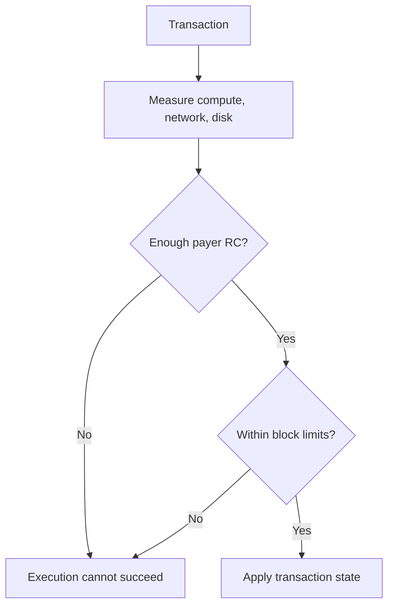

# Resources

Koinos limits blockchain work through Resource Credits (RC) rather than a
conventional per-transaction gas fee. Transactions consume measurable
resources, and the protocol checks both the payer's available RC and the
remaining capacity of the block.

On mainnet, wallets commonly present an account's available RC as **mana**. Mana
is recoverable transaction capacity associated with KOIN; spending it does not
transfer KOIN to a block producer as a gas payment.

## Resource types

Koinos accounts for three resources:

| Resource | What it measures | Why it is limited |
| --- | --- | --- |
| Compute bandwidth | Contract execution, authorization, system calls, and other processing | Prevents unbounded execution |
| Network bandwidth | Canonically encoded transaction data carried by the network | Keeps blocks and peer traffic bounded |
| Disk storage | Persistent state created or changed by execution | Limits long-term node storage growth |

A transaction can use all three in different proportions.

## Account Resource Credits

Before committing a transaction, Chain determines the account responsible for
its resources and reads that account's available RC. Authorization and payer
semantics can make the payer different from the account that submitted or
signed another part of the transaction.

The transaction must remain within the available RC calculated for its
execution. The exact mana regeneration rules and payer behavior are implemented
by system contracts and can evolve through governance.

## Block resource limits

Each block also has compute, network, and disk limits. These bounds protect the
network even when an individual payer has enough RC.

The resources system contract maintains resource markets used to calculate the
current limits and RC cost for each resource. Usage changes the market state
from block to block, so applications should query current limits instead of
embedding fixed values.

Block processing also has resource costs outside ordinary transactions. A block
producer must satisfy the production and resource requirements for its block;
having VHP alone is not the complete readiness condition.

## Mathematical model

The Resources system contract uses an internal constant-product market for each
resource type. The separate
[Resource market mathematics](resource-market-mathematics.md) page derives its
resource-supply update, per-block RC allocation, invariant, limits, and
rounding behavior from the selected versioned implementation.

## Architecture versus operation

This page describes the accounting boundary. Current values, monitoring,
capacity planning, and producer checks belong in
[Node Operators](../nodes/index.md). Privileged resource-contract behavior
belongs in [System Contracts](../system-contracts/resources.md).

## Versioned sources

- [Resource system contract reference implementation](https://github.com/koinos/koinos-contracts-cpp/blob/80f55538a5fbf6526e2e1df93d9bf4981eb6c2e7/contracts/resources/resources.cpp)
- [Resource schemas in `koinos-proto` v2.6.0](https://github.com/koinos/koinos-proto/tree/f3ba7c54d72ddd7b6898a0e2ab7567dcf60ccd80/koinos/contracts/resources)
- [Chain resource system calls in `koinos-proto` v2.6.0](https://github.com/koinos/koinos-proto/blob/f3ba7c54d72ddd7b6898a0e2ab7567dcf60ccd80/koinos/chain/system_calls.proto)
