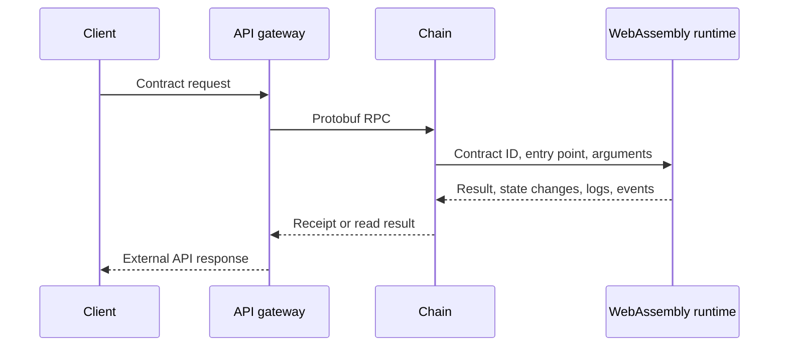

# Smart contracts

Koinos smart contracts are WebAssembly modules executed by Chain. Contracts
implement application behavior, and selected system contracts also implement
protocol behavior that would otherwise require a native node upgrade.

The node remains responsible for validation, execution context, resource
metering, state commits, receipts, and consensus. Contract code cannot bypass
those boundaries.

## Execution boundary

A contract call identifies:

- a contract ID;
- a 32-bit entry point; and
- protobuf-encoded argument bytes.

Chain loads the contract, creates an execution context, invokes the entry point,
meters the work, and returns protobuf-encoded result bytes. The
[Contract ABI](contract-abi.md) lets tools map human-readable method names to
entry points and message types.

## Read-only calls and transactions

A `read_contract` RPC executes a contract against node state without committing
state changes. It is suitable for queries, but its result reflects the Chain
state reached by that node.

A writable contract call is an operation inside a signed transaction. Chain
checks authorization, nonce, resource availability, and contract execution
before committing the resulting state. If execution fails, the state changes
from that transaction are not committed.

The API path does not change these rules. JSON-RPC, gRPC, and REST only
translate or route the request.

## Contract state

Contract objects are stored in named object spaces. A user contract's storage
is separated by its contract identifier and object-space ID. System contracts
can receive authority to work with system state and replace selected
[system calls](system-calls.md).

State becomes part of the selected chain only when the containing transaction
and block are accepted. Recent accepted state can still change after a fork
until it becomes irreversible.

## Calls, logs, and events

A contract can call another contract through the `call` system call. Chain
creates a nested execution frame, preserves caller context, and returns the
callee's encoded result.

Contracts can emit:

- **logs**, intended primarily for execution diagnostics; and
- **events**, structured protobuf data recorded in receipts and distributed to
  interested services.

The caller and callee must agree on the protobuf types used for arguments,
results, and events.

## User and system contracts

User contracts build applications within the normal runtime permissions. System
contracts have explicitly assigned protocol responsibilities and can override
selected system-call behavior.

This page explains the runtime boundary. Privileged contracts and governance
controls belong in [System Contracts](../system-contracts/index.md), while build
and deployment procedures belong in
[Smart Contract Development](../contracts/index.md).

## Versioned sources

- [`koinos-chain` v1.5.2](https://github.com/koinos/koinos-chain/tree/0ae99eced8b585c4145424e9c2a28f667796cc66)
- [Contract operations in `koinos-proto` v2.6.0](https://github.com/koinos/koinos-proto/blob/f3ba7c54d72ddd7b6898a0e2ab7567dcf60ccd80/koinos/protocol/protocol.proto)
- [System-call schemas in `koinos-proto` v2.6.0](https://github.com/koinos/koinos-proto/blob/f3ba7c54d72ddd7b6898a0e2ab7567dcf60ccd80/koinos/chain/system_calls.proto)
