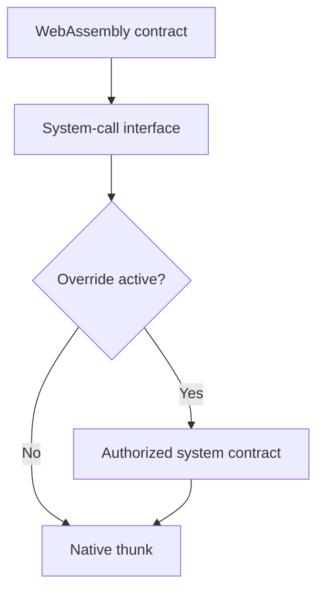

# System calls

System calls are the controlled interface between WebAssembly contracts and the
capabilities provided by Chain. A contract uses them to read or write state,
inspect its execution context, call another contract, emit an event, use
cryptographic functions, or consume blockchain resources.

An ordinary contract call invokes another contract's entry point. A system call
crosses from the contract runtime into a capability managed by the blockchain
framework.

## System calls and thunks

Each system call has a native implementation called a **thunk**. Chain dispatches
the call to that implementation unless the active protocol configuration
assigns an authorized system contract as the override.

This design leaves low-level capabilities in the node while allowing selected
protocol behavior to change through governed contract upgrades. A system
contract can call a thunk directly when it needs the native primitive as part
of its implementation.

## Capability groups

The versioned schema defines system calls in several groups:

| Group | Examples |
| --- | --- |
| Execution context | Current block, transaction, operation, caller, and contract ID |
| State | Read, write, remove, and iterate objects |
| Contract execution | Read arguments, call another contract, and exit |
| Authorization | Check account or system authority and verify nonces |
| Resources | Read account Resource Credits and consume transaction or block resources |
| Cryptography | Hashing, signature verification, public-key recovery, Merkle proofs, and VRF verification |
| Observability | Contract logs and structured events |
| Protocol hooks | Block, transaction, and operation processing callbacks |

The complete list is tied to the selected `koinos-proto` and Chain releases.
Applications should not copy a static list into their own compatibility logic.

## Consensus and security boundary

System calls run inside deterministic block execution. Their results, state
changes, resource use, logs, and events contribute to the transaction receipt
and the state selected by consensus.

Changing a system-call override changes protocol behavior. Only operations with
the required system authority can make that assignment. The governance and
privileged-contract model is documented under
[System Contracts](../system-contracts/index.md).

Contract developers normally use their SDK's typed system-call wrappers rather
than constructing the low-level protobuf messages directly.

## Versioned sources

- [System-call schemas in `koinos-proto` v2.6.0](https://github.com/koinos/koinos-proto/blob/f3ba7c54d72ddd7b6898a0e2ab7567dcf60ccd80/koinos/chain/system_calls.proto)
- [Chain thunk documentation at v1.5.2](https://github.com/koinos/koinos-chain/blob/0ae99eced8b585c4145424e9c2a28f667796cc66/docs/thunks.md)
- [Chain system-call implementation at v1.5.2](https://github.com/koinos/koinos-chain/tree/0ae99eced8b585c4145424e9c2a28f667796cc66/src/koinos/chain)
