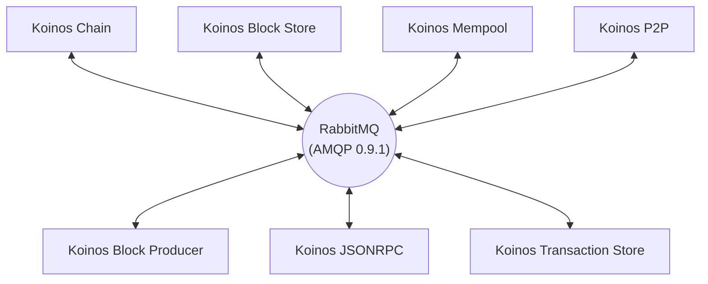
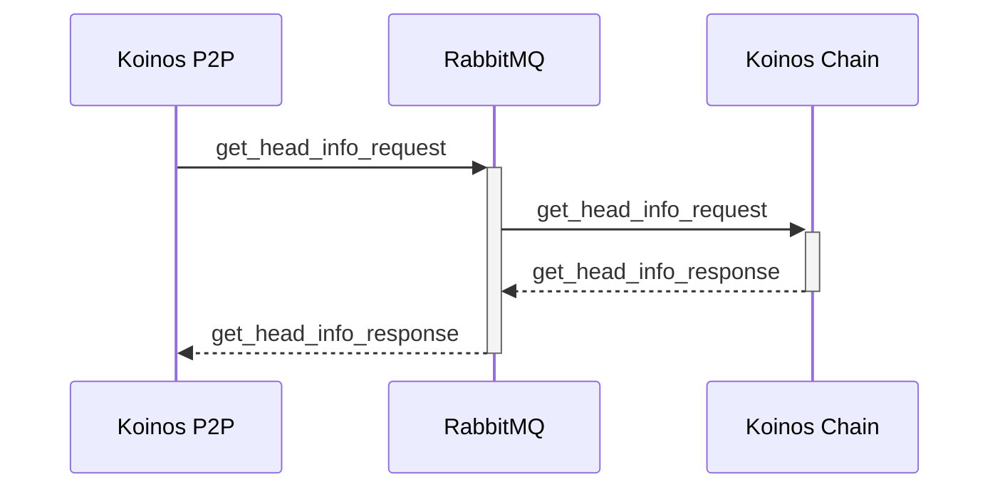
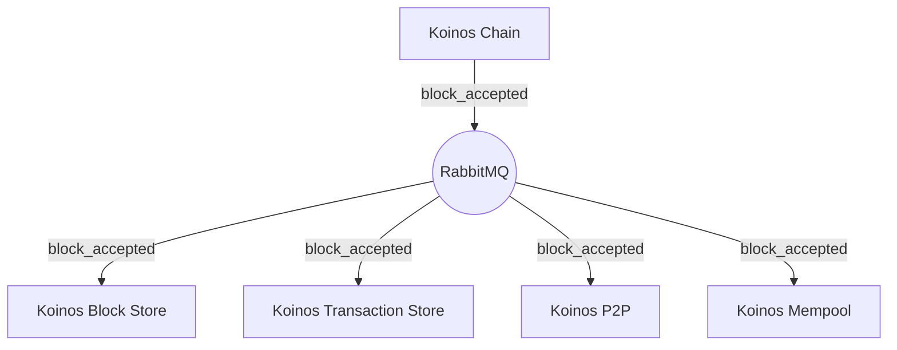

# Microservice architecture

## Preamble

A microservice architecture has many advantages over a more traditional monolithic architecture. By breaking up a complex application into a set of loosely coupled services, software becomes highly maintainable and easily verifiable while providing a great degree of deployment flexibility. Improving or replacing microservices become a trivial task - this allows for low-risk upgrade paths. An additional benefit that should not be underestimated is the ability to choose the programming language best fit for the microservice at hand.

With a microservice architecture, onboarding engineers becomes a more feasible task as engineers can more easily master one or more services without having to understand the details of the larger complicated system. This will lead to more productive hires and higher quality contributions.

## Koinos cluster

The Koinos cluster implements the Koinos protocol leveraging the benefits of microservice architectures. The microservices provided by Koinos Group facilitates all the necessary functions to power the Koinos blockchain (see **Table 1** below for a complete list).

> _**Table 1.** A table containing information about the core microservices of a Koinos cluster._

|Microservice|Language|Responsibilities|
|---|---|---|
|[Koinos Chain](https://github.com/koinos/koinos-chain)                        |C++|Processing blocks and maintaining the state of the chain|
|[Koinos Block Store](https://github.com/koinos/koinos-block-store)            |Golang|Storing block information|
|[Koinos P2P](https://github.com/koinos/koinos-p2p)                            |Golang|P2P communication between node clusters|
|[Koinos Mempool](https://github.com/koinos/koinos-mempool)                    |C++|Storing transactions that have yet to be included in blocks|
|[Koinos Transaction Store](https://github.com/koinos/koinos-transaction-store)|Golang|Storing transaction information|
|[Koinos Block Producer](https://github.com/koinos/koinos-block-producer)      |C++|The production of blocks|
|[Koinos JSONRPC](https://github.com/koinos/koinos-jsonrpc)                    |Golang|Providing API access from outside the cluster|

Communication between microservices is accomplished by taking advantage of the battle hardened _Advanced Message Queue Protocol_ ([AMQP 0.9.1](https://www.amqp.org/specification/0-9-1/amqp-org-download)) as implemented by [RabbitMQ](https://www.rabbitmq.com/). Each microservice maintains a connection to RabbitMQ which it uses to send and receive _Remote Procedure Calls_ (RPC) as well as broadcast messages. Microservices avoid the need for polling by utilizing broadcast messages in order to implement an event driven paradigm.

> _**Figure 1.** A diagram demonstrating the interprocess communication data flow within a Koinos cluster._

Because of the extensibility of the Koinos cluster, users can develop custom microservices that provide additional functionality. User-created microservices have first class citizenship - in other words, they have the same capabilities of any core microservice provided by Koinos Group. This enables engineers and entrepreneurs to provide unique business propositions that would otherwise be difficult to implement - no longer is polling and parallel data storage required when you have access to the core event driven system.

## Interprocess communication

Communication between microservices is accomplished utilizing the AMQP 0.9.1 protocol. The Koinos cluster uses the hub and spoke model as shown in **Figure 1** above. Messages between microservices can either be RPC or broadcast (see **Table 2** below for a more detailed explanation). Messages originating from a particular microservice will be directed through an exchange on RabbitMQ; through `koinos.rpc` and `koinos.event` for RPC and broadcasts, respectively.

> _**Table 2.** A table containing information about the types of messages and exchanges within a Koinos cluster._

|Message type|Exchange|Example request(s)|Characteristics|
|---|---|---|---|
|RPC       |`koinos.rpc`  |`get_head_info` `get_blocks_by_height` `get_account_nonce` `get_chain_id`  |The traditional request/response  model|
|Broadcast |`koinos.event`|`block_accepted` `transaction_accepted` `block_irreversible` `fork_heads`  |An event driven model - messages  are generally sent from one to many|

### RPC

Each microservice that serves RPC requests binds to a durable queue. The system is designed such that each microservice can be scaled up and down based on the load required by the particular Koinos cluster. This is implemented via a competitive consumer model, i.e., multiple instances of a microservice competing to service requests off a single queue.

From a high level, each service makes requests by sending an RPC message to the `koinos.rpc` exchange on the RabbitMQ server. RabbitMQ directs messages from the `koinos.rpc` exchange to the corresponding queue using a routing key. The routing key matches the name of the destination queue. The response messages are matched to the request using a Correlation ID - that is attached to the original request message and the resulting response.

> _**Figure 2.** A diagram demonstrating the data path of an RPC request from Koinos P2P to Koinos Chain._

### Broadcast

When an event occurs within a Koinos cluster, such as when a block is accepted into a fork of the chain, a broadcast message is emitted (as shown in **Figure 3** below). The broadcast message is not directed to any particular consumer, it is intended for any consumer who may be interested. This essentially behaves similar to a publisher/subscriber paradigm where a message is sent on a particular topic.

> _**Figure 3.** A diagram demonstrating the data path of a `block_accepted` message._

The advantage of a broadcast message is that it allows for the loose coupling of services. It also facilitates the seamless integration of user-created microservices. Reacting to the acceptance of a block, for example, will likely be leveraged by most custom applications and requires no changes to the core Koinos cluster microservices.

To receive broadcasts, one must create an anonymous queue and bind it to the `koinos.event` exchange. Using the routing key, one may specify topics of interest. In the case of block acceptance, the corresponding routing key would be `koinos.block.accept`. Wildcards may be used to simplify this process. For example, if an application must be notified about all events involving a block, the routing key can be specified as `koinos.block.*`.
