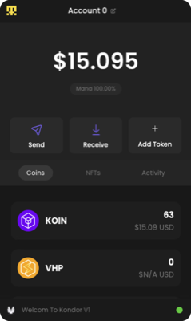

# Accounts, Keys, and Wallets

Learn about Koinos accounts, cryptographic keys, and wallet management in the Koinos ecosystem.

## 🔑 Accounts and Keys in Koinos

In Koinos, an **account** is essentially an identity on the blockchain, represented by a public address. Every account is controlled by a key pair: a private key and and public key:

**Private Key** → A secret used to sign transactions. Whoever controls the private key has authority over the account.
*Example:* `5KJvsngHeMpm884wtkJNzQGaCErckhHJBGFsvd3VyK5qMZXj3hS`

**Public Key** → Derived from the private key and used to generate the account's address.
*Example:* `03a34b99f22c790c4e36b2b3c2c35a36db06226e41c692fc82b8b56ac1c540c5bd`

!!! info "Technical Deep Dive: Private and Public Key Generation"

    Koinos uses **secp256k1 elliptic curve cryptography**, the same system as Bitcoin. Here's how key pairs are generated:

    **Step 1: Generate Private Key**  
    A private key is a random 256-bit number (32 bytes). It must be between 1 and the curve order:
    ```
    Random 256-bit number: 0x18e14a7b6a307f426a94f8114701e7c8e774e7f9a47e2c2035db29a206321725
    Base58 encoded:        5KJvsngHeMpm884wtkJNzQGaCErckhHJBGFsvd3VyK5qMZXj3hS
    ```

    **Step 2: Calculate Public Key**  
    Multiply the private key by the generator point G on the secp256k1 curve:
    ```
    Public Key = Private Key × G (elliptic curve multiplication)
    Result: 03a34b99f22c790c4e36b2b3c2c35a36db06226e41c692fc82b8b56ac1c540c5bd
    ```

    **Key Properties:**
    
    - **One-way function**: Easy to go from private → public, impossible to reverse
    - **Compression**: Public keys can be compressed (33 bytes) or uncompressed (65 bytes)
    - **Security**: 256-bit private keys provide 128 bits of security (quantum-resistant for now)
    - **Randomness**: Private key must be cryptographically secure random

**Address** → The identifier you share with others so they can send you tokens.
*Example:* `1DQzuCcTKacbs9GGScRTU1Hc8BsyARTPqe`

!!! info "Technical Deep Dive: Address Generation Process"

    Koinos addresses use **Base58Check encoding**, which makes them human-readable and helps prevent typing errors. Here's how an address is generated from keys:

    **Step 1:** Start with your public key  
    `03a34b99f22c790c4e36b2b3c2c35a36db06226e41c692fc82b8b56ac1c540c5bd`

    **Step 2:** Apply RIPEMD160 hash to the SHA256 hash of the public key  
    This creates a 20-byte hash: `89abcdefabbaabbaabbaabbaabbaabbaabbaabba`

    **Step 3:** Add version byte and checksum, then encode with Base58  
    Final address: `1DQzuCcTKacbs9GGScRTU1Hc8BsyARTPqe`

    **Address Format Features:**
    
    - Always starts with `1` for standard addresses
    - Uses Base58 alphabet (no 0, O, I, l to avoid confusion)  
    - Built-in checksum prevents most typing errors
    - Case-sensitive (uppercase and lowercase matter)


### What Makes Koinos Different?

Unlike most blockchains, account authority in Koinos is **flexible**. Instead of being tied only to a private key, the "authority" of an account can be delegated to a smart contract.

This programmable authority enables multi-signature accounts where several people must sign to authorize transactions, social recovery mechanisms where friends or contracts can restore access, custom authorization logic like time-locked transactions and business rules, and eliminates gas fees through Koinos' Mana system.

**Simple Summary:**  
👉 A Koinos account = public identity  
👉 Controlled by: private key(s) **or** a smart contract

## 🪙 Wallets in the Koinos Ecosystem

There are currently three main ways to manage accounts and keys in Koinos:

### Kondor Wallet (Browser Extension)

Kondor is a browser extension (like MetaMask, but for Koinos) that provides a user-friendly interface to create and import accounts, see balances, manage Mana, send and receive tokens, and interact with dApps. When you create a new account, it generates a seed phrase that can be backed up and later restored. Kondor also supports Mana delegation and NFT viewing.

<figure markdown="span">
  
  <figcaption><small>Kondor wallet showing KOIN balance</small></figcaption>
</figure>

**Best choice for:** Everyday users who want a simple, graphical wallet.

**Quick Start:**
1. Install from [Chrome Web Store](https://chromewebstore.google.com/detail/kondor/ghipkefkpgkladckmlmdnadmcchefhjl)
2. Create new account (generates seed phrase) or import existing
3. Start interacting with Koinos dApps

📖 **[Complete Kondor Wallet Guide →](kondor-wallet.md)**

### Koinos CLI Wallet (Command Line Interface)

The CLI wallet is part of the Koinos toolset for developers. It lets you generate key pairs, import and export accounts, and sign and send transactions directly from the terminal. Much more technical than browser wallets, but extremely powerful for automation and scripting.

**Step 1:** Start the CLI and connect to the Koinos network:
```bash
koinos-cli --rpc https://api.koinos.io/
```

**Step 2:** Create a new wallet with a password:
```bash
create my-wallet mypassword
```

**Step 3:** Generate a new key pair:
```bash
generate_key
```

**Step 4:** Transfer tokens between accounts:
```bash
transfer <from> <to> <amount>
```

**Best choice for:** Developers, power users, and exchanges who need automation or want to build scripts that interact with Koinos.

📖 **[Complete CLI Wallet Guide →](cli-wallet.md)**

### Sovrano Wallet (Smart Wallet / dApp)

Sovrano is a next-generation smart wallet and identity system for Koinos, currently in beta development. It focuses on mainstream usability with no seed phrases (passwordless, passkey-based login), social recovery and modular plugin system, and fiat on/off ramps for easier adoption. Designed to give a Web2-like user experience while still being non-custodial.

<figure markdown="span">
  
  <figcaption><small>Sovrano smart wallet with passwordless authentication</small></figcaption>
</figure>

**Best choice for:** The future of mass adoption and new users unfamiliar with crypto complexity.

📖 **[Complete Sovrano Wallet Guide →](sovrano-wallet.md)**

## 🎯 Wallet Comparison

| Wallet | Interface | Best For | Status | Key Feature |
|--------|-----------|----------|--------|-------------|
| **Kondor** | Browser Extension | Everyday users | ✅ Available | Easy dApp integration |
| **CLI** | Command Line | Developers | ✅ Available | Full automation control |
| **Sovrano** | Web dApp | Mainstream users | 🚧 Beta | No seed phrases |

## Next Steps

Ready to dive deeper? Check out the complete guides for [Kondor Wallet](kondor-wallet.md), [CLI Wallet](cli-wallet.md), or [Sovrano Wallet](sovrano-wallet.md). 

Continue learning about [Mainnet vs Testnet](mainnet-vs-testnet.md) to understand different networks, or explore the [Tooling Overview](tooling-overview.md) for essential development resources.

Ready to start building? Jump into [Interacting with Koinos](../interacting/index.md) or learn about [Smart Contract Development](../contracts/index.md).