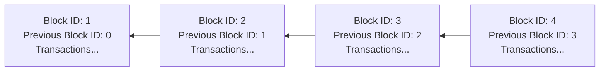

# Blockchain basics
By now you've likely heard quite a bit about the blockchain. Throughout the years blockchain has undergone rapid evolution and it might seem difficult to keep up. From the initial release of Bitcoin to more contemporary blockchains like Koinos, it is a challenge to keep up with the technical advancements in the space.

This document aims to guide you through blockchain concepts and the specific features offered by Koinos so you can begin participating in the future of the internet.

---
## What is a blockchain?
In simple terms, the blockchain is a ledger or a series of records. It is analogous to a spreadsheet or accounting book.

However, there is a key distinction, a blockchain is decentralized. Rather than the records being maintained by one entity, in one location, it is maintained and verified by many computers around the world. This eliminates a single point of failure and offers transparency for those who participate in the network. It is this decentralized nature that provides the trustless attribute to many blockchain protocols.

There are many use-cases for blockchain but most commonly people leverage blockchain technology as a way to store data, transfer value, and even run programs.

_**Figure 1.** A diagram depicting the basic structure of a blockchain._

---
## What is a cryptocurrency?
Cryptocurrency is a type of digital or virtual currency that uses cryptography for security and operates on decentralized networks based on blockchain technology. Unlike traditional currencies issued by governments, cryptocurrencies are typically decentralized and not controlled by any single authority. They enable secure, peer-to-peer transactions without the need for intermediaries like banks.

---
## What is the difference between a coin and a token?
In cryptocurrency, the terms "coin" and "token" are often used interchangeably, but they represent different concepts:

**Coin:** A coin refers to a digital currency that operates independently on its own blockchain. Examples of coins include Bitcoin (BTC), Koin (KOIN), and Ethereum (ETH). These coins typically serve as a medium of exchange, store of value, or unit of account within their respective blockchain networks.

**Token:** A token, on the other hand, represents a digital asset or utility that is built on top of an existing blockchain platform. Tokens can serve various purposes such as representing ownership of assets, access to services, voting rights, or loyalty rewards within a specific ecosystem.

In summary, coins are native currencies of their own blockchain networks, while tokens are digital assets or utilities built on existing blockchain platforms.

---
## What is a consensus algorithm?
A consensus algorithm is a set of rules or protocols that enable multiple participants in a distributed network to reach an agreement on the validity of transactions or data. In the context of blockchain technology, consensus algorithms are essential for maintaining the integrity and security of the network. They ensure that all nodes (participants) in the network agree on the state of the ledger and the order of transactions.

Consensus algorithms vary depending on the design and goals of the blockchain network. They dictate how nodes communicate, propose, validate, and agree upon new blocks of transactions. Common consensus algorithms include Proof-of-Work (PoW), Proof-of-Stake (PoS), Proof-of-Burn(PoB), Practical Byzantine Fault Tolerance (PBFT), Delegated Proof-of-Stake (DPoS), and many others.

Overall, consensus algorithms play a crucial role in decentralized systems by enabling trustless transactions and ensuring the immutability of the ledger without the need for a central authority.

---
## What is a smart contract?
A smart contract is a self-executing contract with the terms of the agreement directly written into code. It is deployed and executed on a blockchain platform such as Koinos. Smart contracts allow for the automation and enforcement of agreements without the need for intermediaries.

Once deployed, a smart contract operates according to the predefined rules encoded within it, executing actions when specified conditions are met. These contracts can be used to facilitate a wide range of applications, including decentralized finance (DeFi), supply chain management, voting systems, and more. Smart contracts contribute to increased transparency, efficiency, and security in various industries by reducing the reliance on centralized authorities and minimizing the potential for fraud or manipulation.

---
## What is a dApp?
A dApp, short for decentralized application, is an application that operates on a decentralized network or blockchain platform rather than relying on a centralized server. dApps typically use smart contracts to execute logic and store data on the blockchain, enabling peer-to-peer interactions without the need for intermediaries.

dApps can serve various purposes, including decentralized finance (DeFi), gaming, social networks, supply chain management, and more. Examples of popular dApps include Uniswap (a decentralized exchange), CryptoKitties (a blockchain-based game), and Compound (a lending protocol).

---
## What is Web3?
Web3 refers to the vision of a new, decentralized iteration of the internet that is built on blockchain technology and decentralized protocols. It represents a paradigm shift from the current centralized web (Web 2.0) to a more open, transparent, and user-centric internet ecosystem.

Overall, Web3 represents a vision for a more decentralized, user-centric internet that fosters innovation, transparency, and financial accessibility. It aims to address some of the limitations and challenges of the current centralized web, such as data privacy concerns, censorship, and lack of user control.

---
## Why do we need decentralization?
Decentralization is essential because it provides resilience against single points of failure, ensuring that no single entity or authority has absolute control. It fosters censorship resistance, enabling freedom of expression and financial autonomy.

Moreover, decentralization enhances security by distributing data across a network, making it harder for malicious actors to compromise. It also promotes innovation by lowering barriers to entry and fostering competition among participants.

Additionally, decentralization empowers individuals by giving them greater control over their personal data and financial assets, promoting financial accessibility and transparency in governance and decision-making processes.

---
## Why Koinos?
Koinos is engineered from the ground up to be energy efficient, promote decentralization, infinitely evolve, execute extremely quickly, and most of all allow for transactions without fees. The unique design of Koinos allows developers to create unstoppable decentralized applications with no barrier to onboard new users.

### For developers
It is core to Koinos to focus on the developer experience. This is why it is designed in a language agnostic manner allowing developers to work with programming languages developers know and love.

The inherent problem of transaction fees has plagued smart contracts platforms for far too long. It is now possible to give end users a Web2 experience on the next generation Web3 platform, Koinos.

Don't kneecap your vision, shoot for the stars and onboard the masses on Koinos!

### For users
For end users, the ability to interact with their favorite decentralized applications without transaction fees offers a user experience like no other blockchain and one that can finally rival Web2.

Play Web3 games where you control your own in-game assets, manage your financial future with DeFi, be free of censorship all without paying a dime in transaction fees!

---
## Join the Web3 revolution
You're not alone! Join our growing community of dedicated blockchain developers, users, and enthusiasts on both [Telegram](https://telegram.koinos.io) and [Discord](https://discord.koinos.io) today!

---
Want to learn more? Let's keep going!