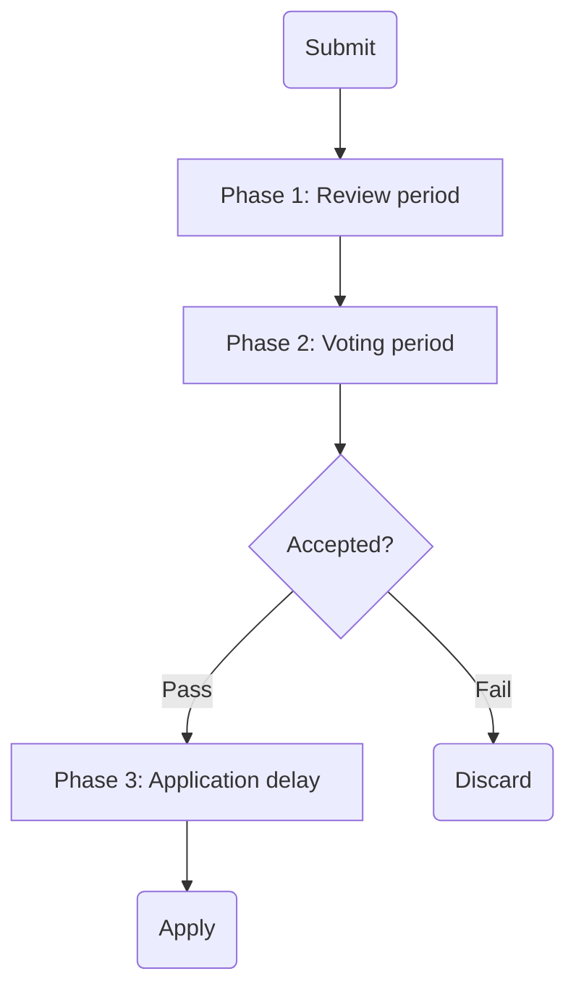

# Governance
The Koinos blockchain employs an innovative on-chain governance system designed to ensure decentralized decision-making and network evolution. Through its on-chain governance model, Koinos enables block producers to actively participate in protocol upgrades, parameter adjustments, and the introduction of new features directly on the blockchain.

Because the core functionality of Koinos is implemented via [smart contracts](smart-contracts.md), protocol upgrades propagate through the network therefore avoiding cumbersome hard-forks. This feature promotes network cohesion and facilitates the smooth operation during feature upgrades and enhancements. In addition, it allows validators to continue supporting the network without shutting down their node and manually ugprading their software.

---
## Proposals
Proposals are transactions that upon approval have special privileges to make changes to the system. A proposal is submitted to the governance contract and goes through three distinct phases.

### Phase 1: The review period
After submission, a proposal enters a review period. This essentially amounts to a waiting period where interested parties can retrieve and review the contents of a particular proposal. This is designed to give block producers their final chance to examine and understand the implications of the proposal. In the current implementation it lasts approximately one week.

### Phase 2: The voting period
When the review period has concluded the proposal enters the voting period. During the voting period block producers attach the proposals they approve of to the blocks they submit to the network. The more blocks a block producer submits to the network the more weight their approvals carry. This process lasts for approximately two weeks. If a proposal is not approved the process ends here. However, if the proposal is approved it moves on to the next phase.

### Phase 3: The application delay
The application delay is a period set aside for the network to prepare for the upcoming proposal. There may be implications for block producers or smart contracts. This gives the relevant parties time to adjust for the changes coming down the pike. The application delay phase lasts approximately one week.

---
## Governance thresholds
Not all proposals are created equal. Some proposals simply add a new feature. Other proposals could affect governance itself. For this reason there are different voting thresholds that must be met in order to consider a proposal accepted.

### Standard threshold
For proposals that do not attempt to alter the governance system itself a standard threshold of 60% applies. In practice, this means that 60% or better of all blocks during the voting period must approve of said proposal.

### Governance threshold
Proposals that would change the governance itself has a higher barrier of acceptance. In this case, a higher threshold of 75% applies. As one would except, this means that 75% of all blocks submitted during the voting period must approve the given proposal.