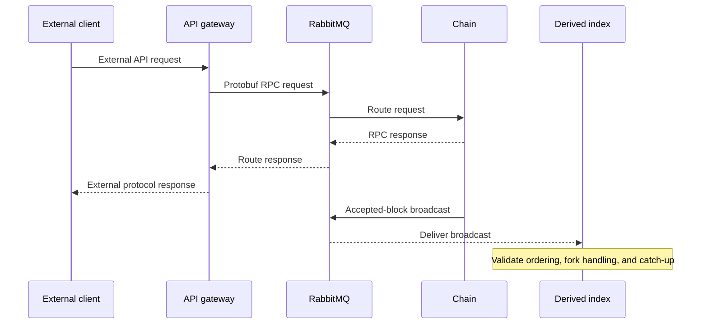

# Internal Messaging

> [!IMPORTANT]
> **Internal draft — not published.** Exchange names and message relationships
> were checked at pinned revisions and must be revalidated before publication.

## Purpose

Koinos microservices communicate through RabbitMQ using protobuf messages. This
internal messaging layer lets a service call another service without embedding
it in the same process and lets one event be observed by multiple interested
services.

RabbitMQ is an internal coordination component. It is not the peer-to-peer
network, and it should not be described as the transport between independent
Koinos nodes.

## Two communication patterns

### RPC

An RPC has a request, one target service, and a response. The protobuf RPC
definitions identify the service and method contracts. Gateways such as
JSON-RPC and gRPC translate external requests into these internal calls.

At the inspected revisions, service RPC messages use the `koinos.rpc` exchange
family.

### Broadcasts

A broadcast announces a state change or observation to any subscribed service.
Examples include accepted blocks, irreversible blocks, accepted or failed
transactions, fork heads, gossip status, and contract events.

At the inspected revisions, broadcast messages use the `koinos.event` exchange
family. Broadcast consumers remain responsible for ordering, idempotency,
catch-up, and fork behavior appropriate to their state.

## Message contracts

The pinned `koinos-proto` revision defines these broadcast message types:

- `transaction_accepted`
- `transaction_failed`
- `mempool_accepted`
- `block_accepted`
- `block_irreversible`
- `fork_heads`
- `gossip_status`
- `event_parcel`

The exact routing key, payload version, and consumer behavior must be read from
the matching service and protocol revisions. A message name alone does not
establish delivery guarantees or database consistency.

## Failure and consistency considerations

- If RabbitMQ is unavailable, local services may remain running while RPC and
  broadcast coordination is interrupted.
- RPC timeouts do not establish whether the target completed work; callers need
  method-specific retry semantics.
- Broadcast delivery and database commit are separate events. Consumers need
  idempotent or otherwise safe processing.
- A slow indexer can expose data behind the Chain head.
- Fork changes can invalidate previously observed non-irreversible state.
- RabbitMQ durability and queue policy are deployment concerns and belong in
  Node Operators, but Architecture must explain their consistency impact after
  those policies are verified.
- Adding service replicas is not automatically safe. Stateful writers and
  broadcast consumers need explicit ownership and coordination rules.

## Verification before publication

- Confirm the exchange and routing conventions against the release selected for
  documentation.
- Map the RPC methods and broadcasts used by each service from compatible
  revisions.
- Confirm queue durability, replay, redelivery, and ordering behavior with the
  implementation and maintainers.
- Distinguish behavior guaranteed by protobuf contracts from behavior provided
  by the current RabbitMQ client libraries.
- Decide whether contract event routing belongs here or in the Smart Contracts
  architecture page.

## Versioned sources

- [`koinos-proto` RPC envelope](https://github.com/koinos/koinos-proto/blob/f3ba7c54d72ddd7b6898a0e2ab7567dcf60ccd80/koinos/rpc/rpc.proto)
- [`koinos-proto` service definitions](https://github.com/koinos/koinos-proto/blob/f3ba7c54d72ddd7b6898a0e2ab7567dcf60ccd80/koinos/rpc/services.proto)
- [`koinos-proto` broadcasts](https://github.com/koinos/koinos-proto/blob/f3ba7c54d72ddd7b6898a0e2ab7567dcf60ccd80/koinos/broadcast/broadcast.proto)
- [`koinos/koinos` RabbitMQ service](https://github.com/koinos/koinos/blob/821674672e699bf56e94d7c0e8bce122e83d1482/docker-compose.yml)
