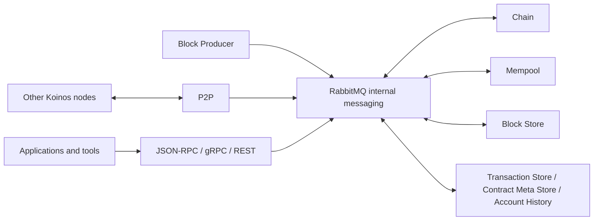

# Microservices Overview

> [!IMPORTANT]
> **Internal draft — not published.** This architecture model is based on pinned
> official revisions and must be revalidated against the release selected for
> future public documentation.

## System model

A Koinos node is composed of cooperating microservices. RabbitMQ carries
internal protobuf RPC messages and broadcasts between those services. P2P is a
separate boundary: it communicates with other Koinos nodes and hands received
blocks and transactions into the local service graph.

The Chain service owns consensus validation and authoritative chain state.
Other stateful services keep either durable blockchain artifacts or derived
indexes. API gateways translate external protocols into internal service
requests; they do not make a response authoritative merely by exposing it.

The arrows show communication relationships, not process ownership or a
complete message-level sequence.

## Service set at the inspected Compose revision

The pinned
[`koinos/koinos` Compose file](https://github.com/koinos/koinos/blob/821674672e699bf56e94d7c0e8bce122e83d1482/docker-compose.yml)
starts a core service set and exposes additional capabilities through Compose
profiles.

| Service | Compose role | Primary responsibility |
| --- | --- | --- |
| RabbitMQ (`amqp`) | Core | Internal service messaging |
| Chain | Core | Consensus validation, execution, fork choice, and canonical state |
| Mempool | Core | Pending transaction and resource reservation state |
| Block Store | Core | Durable blocks and receipts |
| P2P | Core | Peer networking, gossip, and block synchronization |
| Block Producer | Optional profile | Assemble, sign, and submit blocks when production is enabled |
| JSON-RPC | API profile | JSON-RPC gateway to internal services |
| gRPC | API profile | Typed protobuf gRPC gateway |
| REST | API profile | REST/OpenAPI interface backed by JSON-RPC |
| Transaction Store | API profile | Transaction lookup index |
| Contract Meta Store | API profile | Contract metadata and ABI lookup index |
| Account History | API profile | Fork-aware account history index |

This grouping describes that exact Compose revision. It must not be generalized
to all releases without verification.

## Architectural dependency graph

Compose startup dependencies at the inspected revision are:

| Service | Declared service dependencies |
| --- | --- |
| Chain | RabbitMQ |
| Mempool | RabbitMQ, Chain |
| Block Store | RabbitMQ, Chain |
| P2P | RabbitMQ, Block Store, Chain |
| Block Producer | RabbitMQ, Mempool, Chain |
| JSON-RPC | RabbitMQ, Chain |
| gRPC | RabbitMQ, Chain |
| Transaction Store | RabbitMQ, Chain |
| Contract Meta Store | RabbitMQ, Chain |
| Account History | RabbitMQ, Chain, Block Store |
| REST | JSON-RPC |

`depends_on` is a deployment relationship, not a complete architecture
contract. A service can also depend on messages or RPCs from components that
are not represented by a direct startup edge.

## State ownership

| State category | Owner or maintainer | Consistency role |
| --- | --- | --- |
| Canonical chain state | Chain | Consensus-critical and authoritative |
| Blocks and receipts | Block Store | Durable blockchain artifacts |
| Pending transactions | Mempool | Fork-aware, transient working state |
| Transaction lookup | Transaction Store | Derived and rebuildable index |
| Contract metadata and ABI | Contract Meta Store | Derived and rebuildable index |
| Account activity history | Account History | Derived, fork-aware index |
| API protocol state | JSON-RPC, gRPC, REST | Gateway-level only; not canonical blockchain state |

“Derived and rebuildable” does not mean disposable during normal operation.
An index can be unavailable, incomplete, or stale while it catches up, and API
consumers must not confuse that condition with the Chain service's view.

## Cross-cutting consistency rules

- Chain validation and fork choice determine accepted canonical state.
- Services consuming accepted-block broadcasts can lag behind Chain and need
  explicit catch-up and fork handling.
- Mempool state changes as transactions are accepted, rejected, included, or
  invalidated by chain movement.
- P2P transports data across nodes but does not replace local consensus
  validation.
- RabbitMQ availability affects coordination among local services.
- Optional API and index services must not become implicit consensus
  dependencies.
- Stateful services cannot be scaled safely by assuming every instance can
  write the same state independently; ownership and consistency behavior must
  be verified per service.

## Publication questions

Before adapting this overview into public documentation:

- select a coherent release and regenerate the service/profile table;
- confirm which services are considered core, optional, or legacy;
- verify restart, catch-up, and fork behavior with maintainers;
- decide how much failure behavior each target audience needs;
- create a reader-focused diagram that avoids implying unverified data paths.

## Versioned sources

- [`koinos/koinos` Compose topology](https://github.com/koinos/koinos/blob/821674672e699bf56e94d7c0e8bce122e83d1482/docker-compose.yml)
- [`koinos-proto` RPC services](https://github.com/koinos/koinos-proto/blob/f3ba7c54d72ddd7b6898a0e2ab7567dcf60ccd80/koinos/rpc/services.proto)
- [`koinos-proto` broadcast contracts](https://github.com/koinos/koinos-proto/blob/f3ba7c54d72ddd7b6898a0e2ab7567dcf60ccd80/koinos/broadcast/broadcast.proto)
